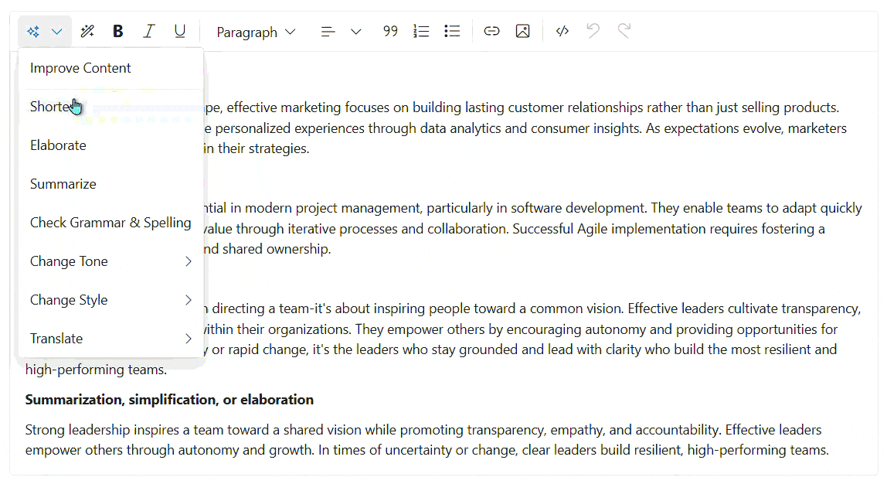

# Syncfusion Blazor Smart Rich Text Editor Component

The `Smart Rich Text Editor` is an AI-enhanced version of the RichTextEditor, designed to streamline content creation and refinement. By integrating artificial intelligence directly into the editing interface, it provides users with sophisticated tools for grammar correction, tone adjustment, content summarization, and natural language queries about their text.

Supported AI capabilities include:
- **Grammar & Style**: Automatically fix grammatical errors and improve writing flow.
- **Tone Adjustment**: Effortlessly switch between formal, casual, professional, or standard tones.
- **Content Transformation**: Summarize long passages, elaborate on brief points, or simplify complex language.
- **Interactive Queries**: Use natural language to request specific changes or insights from the AI.



## Example Use Cases

1. **Professional Communication**
   Refine emails or reports by adjusting the tone to be more professional or standard, and ensure perfect grammar before sharing.

2. **Content Condensing**
   Quickly generate summaries of long articles or meeting notes directly within the editor, saving time in information processing.

3. **Writing Assistance**
   Overcome writer's block by using the "Elaborate" feature to expand on bullet points or the "Rephrase" feature to find better ways to express ideas.

## Adding Syncfusion Smart Rich Text Editor in Blazor

### Prerequisites

1. **Install the Syncfusion SmartRichTextEditor Package**
   Ensure that the `Syncfusion.Blazor.SmartRichTextEditor` NuGet package is installed in your Blazor project.

2. **Configure AI Services** open your `Program.cs` file and add the following code. Replace the placeholders with your actual API credentials.

   ```csharp
    using Syncfusion.Blazor;
    using Syncfusion.Blazor.AI;
    using Azure.AI.OpenAI;
    using Microsoft.Extensions.AI;
    using System.ClientModel;

    var builder = WebApplication.CreateBuilder(args);

    // Add services to the container.
    builder.Services.AddRazorComponents()
        .AddInteractiveServerComponents();

    builder.Services.AddSyncfusionBlazor();

    string azureOpenAIKey = "AZURE_OPENAI_KEY";
    string azureOpenAIEndpoint = "AZURE_OPENAI_ENDPOINT";
    string azureOpenAIModel = "AZURE_OPENAI_MODEL";
    AzureOpenAIClient azureOpenAIClient = new AzureOpenAIClient(
        new Uri(azureOpenAIEndpoint),
        new ApiKeyCredential(azureOpenAIKey)
    );
    IChatClient azureOpenAIChatClient = azureOpenAIClient.GetChatClient(azureOpenAIModel).AsIChatClient();
    builder.Services.AddChatClient(azureOpenAIChatClient);

    builder.Services.AddSingleton<IChatInferenceService, SyncfusionAIService>();

    var app = builder.Build();
    // ... rest of configuration
   ```

   **Using Azure OpenAI**

   To configure Azure OpenAI for Smart Rich Text Editor, refer to the [Azure OpenAI documentation](https://blazor.syncfusion.com/documentation/smart-rich-text-editor/azure-openai-service) for detailed guidance.

### Adding the Smart Rich Text Editor Component

To enable AI features, add the `SfSmartRichTextEditor` component and include the `AI Commands` and `AI Query` items in your toolbar configuration.

```razor
@using Syncfusion.Blazor.SmartRichTextEditor
@using Syncfusion.Blazor.RichTextEditor

<SfSmartRichTextEditor>
    <p>The Agile methodology focuses on iterative development...</p>
    <RichTextEditorQuickToolbarSettings Text="@QuickToolbarItems"></RichTextEditorQuickToolbarSettings>
</SfSmartRichTextEditor>

@code {
    private List<ToolbarItemModel> QuickToolbarItems = new List<ToolbarItemModel>()
    {
        new ToolbarItemModel() { Name = "AI Commands" },
        new ToolbarItemModel() { Name = "AI Query" },
        new ToolbarItemModel() { Command = ToolbarCommand.Separator },
        new ToolbarItemModel() { Command = ToolbarCommand.Bold },
        new ToolbarItemModel() { Command = ToolbarCommand.Italic },
        new ToolbarItemModel() { Command = ToolbarCommand.FontColor }
    };
}
```

## AI Assistant Capabilities

The `Smart Rich Text Editor` introduces two primary AI interaction modes:

### AI Commands
The **AI Commands** toolbar item provides a context-aware menu for common text operations:
- **Improve**: Enhances the overall quality and clarity of selected text.
- **Correct Grammar**: Specifically targets and fixes grammatical and spelling errors.
- **Summarize**: Condenses the selected content into a concise summary.
- **Elaborate**: Adds relevant detail and depth to the selected text.
- **Change Tone**: Offers options to rephrase text in different styles (e.g., Professional, Casual, Fluent).

### AI Query
The **AI Query** feature allows for flexible, free-form interaction. Users can select text and type specific instructions like:
- "Convert this paragraph into a numbered list."
- "Translate this section into Spanish."
- "Make this sound more persuasive for a sales pitch."

## Customization and Styling

For detailed information on customizing the Smart RichTextEditor, please refer to the following guide:

* [Property Configuration](https://blazor.syncfusion.com/documentation/smart-rich-text-editor/property)
* [Methods](https://blazor.syncfusion.com/documentation/smart-rich-text-editor/methods)
* [Events](https://blazor.syncfusion.com/documentation/smart-rich-text-editor/events)
* [Appearance](https://blazor.syncfusion.com/documentation/smart-rich-text-editor/appearance)

## See Also

* [Getting Started with Smart RichTextEditor in Blazor Web App](https://blazor.syncfusion.com/documentation/smart-rich-text-editor/getting-started-webapp)
* [Getting Started with Smart RichTextEditor in Blazor Server App](https://blazor.syncfusion.com/documentation/smart-rich-text-editor/getting-started)
* [Syncfusion Blazor RichTextEditor Documentation](https://blazor.syncfusion.com/documentation/rich-text-editor/getting-started)